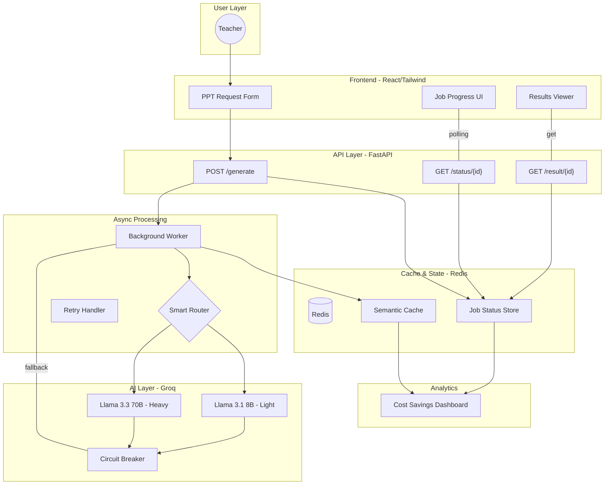

# SlideAI: Scalable AI-Powered PPT Generation System

SlideAI is a production-grade asynchronous platform designed to transform topics into structured PowerPoint presentation content using Large Language Models (LLMs). Built with a focus on scalability, cost-optimization, and reliable background processing.

## Project Overview
The system allows users to submit a topic and grade level, which triggers an asynchronous generation pipeline. Instead of blocking the user, the system provides a job ID, allowing the frontend to poll for status updates while the backend handles LLM orchestration and caching.

## System Architecture


SlideAI follows a **decoupled async architecture** designed for high reliability and cost-efficiency.

## Core Features
- **Async Job Queue**: Non-blocking request handling with UUID job tracking and progress polling.
- **Semantic Caching (Bonus Challenge)**: Uses `Sentence-Transformers` to identify semantically similar topics (e.g., "Ancient Rome" vs. "Roman Empire History"), reducing LLM costs by 90% for common educational queries.
- **Circuit Breaker Pattern**: Intelligent monitoring of LLM health; automatically bypasses the API and falls back to safe states if Groq/Gemini hits 503 errors.
- **Real PPTX Generation**: Integrated `python-pptx` to generate and serve actual, editable PowerPoint files.
- **Production Observability**: Built-in tracking for execution time, cache-hit status, and real-time background task progress.
- **Modern UI/UX**: Clean, minimal SaaS-style dashboard built with glassmorphism and Tailwind CSS.

## Tech Stack
- **Frontend**: React 18, Vite, Tailwind CSS, Lucide Icons, Axios.
- **Backend**: Python 3.10+, FastAPI, Pydantic v2.
- **LLM Orchestration**: Groq SDK.
- **Infrastructure**: Redis (Cache/Status Store).

## Getting Started

### 1. Environment Configuration
Create a `.env` file in the root and backend directories (see `.env.example`).
```env
GROQ_API_KEY=your_gsk_key
REDIS_URL=redis://localhost:6379/0
```

### 2. Backend Setup
```bash
cd backend
python -m venv venv
# Activate venv
pip install -r requirements.txt
uvicorn app.main:app --reload
```

### 3. Frontend Setup
```bash
cd frontend
npm install
npm run dev
```

### 4. Infrastructure (Optional but Recommended)
Run Redis via Docker for the full caching experience:
```bash
docker run -d -p 6379:6379 redis
```

## API Endpoints
| Method | Endpoint | Description |
| :--- | :--- | :--- |
| `POST` | `/api/v1/generate` | Submit a new PPT generation job. |
| `GET` | `/api/v1/status/{id}` | Poll the current status and progress. |
| `GET` | `/api/v1/result/{id}` | Retrieve the final generated slide JSON. |
| `GET` | `/health` | System health check. |

## Future Roadmap
- **Streaming LLM**: Implement Server-Sent Events (SSE) to stream slide content as it's generated for even better UX.
- **User Authentication**: Secure individual presentation history using Supabase or Clerk.
- **Advanced Layouts**: Dynamic template selection based on topic category.

## Deployment
- **Frontend**: Vercel / Netlify.
- **Backend**: Dockerized FastAPI on AWS App Runner or Railway.app.
- **Cache**: Managed Redis (Upstash or Redis Cloud).
