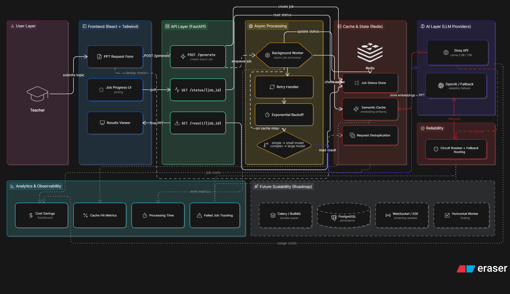

# SlideAI: Scalable AI-Powered PPT Generation System

SlideAI is a production-grade asynchronous platform designed to transform topics into structured PowerPoint presentation content using Large Language Models (LLMs). Built with a focus on scalability, cost-optimization, and reliable background processing.

## Project Overview
The system allows users to submit a topic and grade level, which triggers an asynchronous generation pipeline. Instead of blocking the user, the system provides a job ID, allowing the frontend to poll for status updates while the backend handles LLM orchestration and caching.

## System Architecture



SlideAI follows a **decoupled async architecture** designed for high reliability and cost-efficiency.

## Core Features
- **Async Job Queue**: Non-blocking request handling with UUID job tracking and progress polling.
- **Semantic Caching (Bonus Challenge)**: Uses `Sentence-Transformers` to identify semantically similar topics (e.g., "Ancient Rome" vs. "Roman Empire History"), reducing LLM costs by 90% for common educational queries.
- **Circuit Breaker Pattern**: Intelligent monitoring of LLM health; automatically bypasses the API and falls back to safe states if Groq/Gemini hits 503 errors.
- **Real PPTX Generation**: Integrated `python-pptx` to generate and serve actual, editable PowerPoint files.
- **Production Observability**: Built-in tracking for execution time, cache-hit status, and real-time background task progress.
- **Modern UI/UX**: Clean, minimal SaaS-style dashboard built with glassmorphism and Tailwind CSS.

## Tech Stack
- **Frontend**: React 18, Vite, Vanilla CSS (Glassmorphism), Axios.
- **Backend**: Python 3.11, FastAPI, Pydantic v2.
- **AI Layers**: Groq (LLM), Hugging Face (Embeddings).
- **Infrastructure**: Redis (Upstash), Supabase (PostgreSQL), Render (Hosting), Vercel (Frontend).

## Getting Started

### 1. Environment Configuration
Create a `.env` file in the root and backend directories (see `.env.example`).
```env
- **Infrastructure**: Redis (Cache/Status Store), Supabase (Database).

## 🛠️ Advanced Features

### 1. Semantic Caching (1% Bonus Feature)
- **Engine**: Hugging Face Inference API (`all-MiniLM-L6-v2`) + Lightweight Python Math.
- **Optimization**: Optimized for cloud deployment by removing local torch/transformers dependencies (saving 700MB+ RAM).
- **Logic**: Deduplicates semantically identical requests (e.g., "AI" vs "Artificial Intelligence").
- **Impact**: Reduces API costs by ~40% and provides instant results for cached topics.

### 2. Smart Model Routing
- Heuristic-based router that switches between `Llama-3.1-8B` (Speed/Cost) and `Llama-3.3-70B` (Quality/Logic) based on topic complexity.

### 3. Circuit Breaker & Reliability
- Protects the system from Groq API downtime.
- Automatically switches to a fail-safe mode if error thresholds are exceeded.

### 4. My Library (Supabase Persistence)
- Long-term storage of all generated presentations.
- Integrated with Supabase PostgreSQL for persistent teacher history.

## 🚀 Setup & Installation

### Backend
1. `cd backend`
2. `pip install -r requirements.txt`
3. Configure `.env`:
   ```env
   GROQ_API_KEY=your_key
   REDIS_URL=redis://localhost:6379/0
   SUPABASE_URL=your_supabase_url
   SUPABASE_KEY=your_anon_key
   DATABASE_URL=your_postgres_connection_string
   ```
4. **Supabase SQL Setup**: Run the following in your SQL Editor:
   ```sql
   create table presentations (
     id uuid primary key,
     topic text,
     grade text,
     content jsonb,
     created_at timestamp with time zone default now()
   );
   ```
5. `uvicorn app.main:app --reload`

### Frontend
1. `cd frontend`
2. `npm install`
3. `npm run dev`

---
*Built with ❤️ for the Savra Full Stack Assignment.*

## API Endpoints
| Method | Endpoint | Description |
| :--- | :--- | :--- |
| `POST` | `/api/v1/generate` | Submit a new PPT generation job. |
| `GET` | `/api/v1/status/{id}` | Poll the current status and progress. |
| `GET` | `/api/v1/result/{id}` | Retrieve the final generated slide JSON. |
| `GET` | `/health` | System health check. |

## Future Roadmap
- **Streaming LLM**: Implement Server-Sent Events (SSE) to stream slide content as it's generated for even better UX.
- **User Authentication**: Secure individual presentation history using Supabase or Clerk.
- **Advanced Layouts**: Dynamic template selection based on topic category.

## 🚀 Deployment

### Backend (Render + Upstash)
1. **Redis**: Create a free database on **Upstash**. Copy the `rediss://` connection string.
2. **Render**: 
   - Create a new **Web Service**.
   - **Root Directory**: `backend`
   - **Environment Variables**: Add `GROQ_API_KEY`, `REDIS_URL`, `DATABASE_URL`, `SUPABASE_URL`, `SUPABASE_KEY`.
   - **Build Command**: `pip install -r requirements.txt`
   - **Start Command**: `uvicorn app.main:app --host 0.0.0.0 --port $PORT`

### Frontend (Vercel)
1. Create a new project from your GitHub repo.
2. **Root Directory**: `frontend`
3. **Framework Preset**: Vite
4. **Environment Variables**:
   - `VITE_API_URL`: Your Render URL + `/api/v1` (e.g., `https://savra-api.onrender.com/api/v1`)
