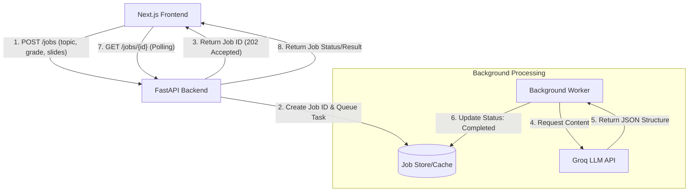

# System Architecture: AI PPT Generator

## System Diagram

## Data Flow
1. **Submission**: User submits a form with PPT parameters.
2. **Acceptance**: Backend validates the request, generates a UUID, stores a "pending" job in the cache, and triggers a background task.
3. **Generation**:
    - The background task prompts Groq with a system message optimized for PPT structure.
    - The LLM returns a structured JSON (title, slides, content per slide).
    - The task updates the job entry with the content and marks it as "completed".
4. **Polling**: The frontend uses a custom hook to check the status every 2 seconds. Once "completed", it renders the preview.

## Scalability Considerations
- **Stateless API**: The FastAPI app is stateless, allowing multiple instances to run behind a load balancer.
- **Cache Persistence**: Moving from in-memory to Redis allows job status to be shared across multiple backend workers.
- **Rate Limiting**: Implementation of rate limiting on the `/jobs` endpoint to prevent API abuse.
- **Error Handling**: Graceful degradation if the LLM fails (e.g., retry logic or returning a partial PPT).
